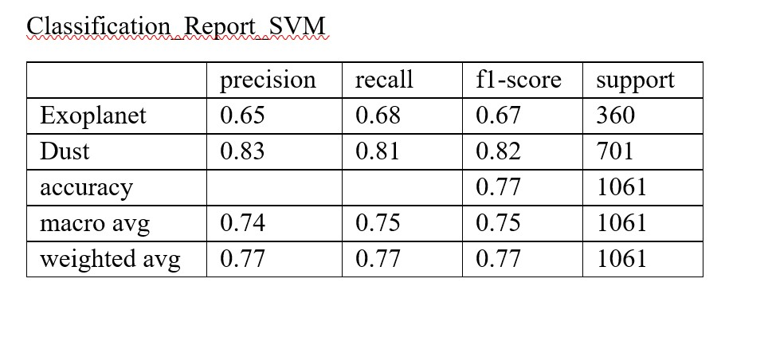

## Machine-Learning-Exoplanet-Exploration

Nasa Kepler space telescope had a mission to find palnets that were outside of solar system. The data was used from [Exoplanet Data Source](https://www.kaggle.com/nasa/kepler-exoplanet-search-results).

### Variables of Interests (explanatory variables)
* koi_period - Orbital Period (days)
* koi_impact - Impact Parameter (dTransit Duration (hours)
* koi_duration - distance between the center of the stellar disc and the center of the planet disc)
* koi_depth - Transit Depth (parts per million)
* koi_prad - Planetary Radius (Earth radii)
* koi_teq - Equilibrium Temperature (Kelvin)
* koi_insol - Insolation Flux [Earth flux]
* koi_model_snr - Transit Signal-to-Noise
* koi_slogg - Surface gravity

### Y Variable (catergorical)
koi_disposition - Canadidate, Confirmed, False Positive
* 1 CONFIRMED
* 2 CANDIDATE (This column was dropped since it is not established as a exoplanet yet).
* 3 FALSE POSITIVE

# Models that were used:
 * Decision tree
 * Random Forest tree
 * SVM
 * Deep Learning
 
 ### Steps taken in predicting koi_disposition

 * Split the data in train and test
 * Create the model
 * Scale values to using standard deviation (StandardScaler)
 * Fit the model (LogisticRegression, DecisionTreeClassifier, RandomForestClassifier)
 * Make prediction
 * Tune model parameters (using GridSearchCV)
 * Get R-scores to show effectiveness
 * Save models

## Conclusion

* DecisionTreeClassifier

Training Data Score: 0.91  
Testing Data Score: 0.894 
Strongest Features: koi_prad 0.35, koi_model_snr 0.27, and koi_teq 0.18  

* RandomForestClassifier

Training Data Score: 0.98   
Testing Data Score: 0.901  
Strongest Features: koi_model_snr 0.20 koi_prad 0.18, koi_teq 0.13  

* SVM 
Training Data Score: 0.66061  
Testing Data Score: 0.66069  

* Deep Learning  
The Deep Learning model has a high Loss value of 0.38 and Accuracy of 0.88. Random Forest Classifier had the best score in comparison with Decision tree, SVM and Neural Network. Also, it is interesting to mention that SVM model predicts False Positives more reliably since we have more false positive observations than confirmed exoplanets cases.  
